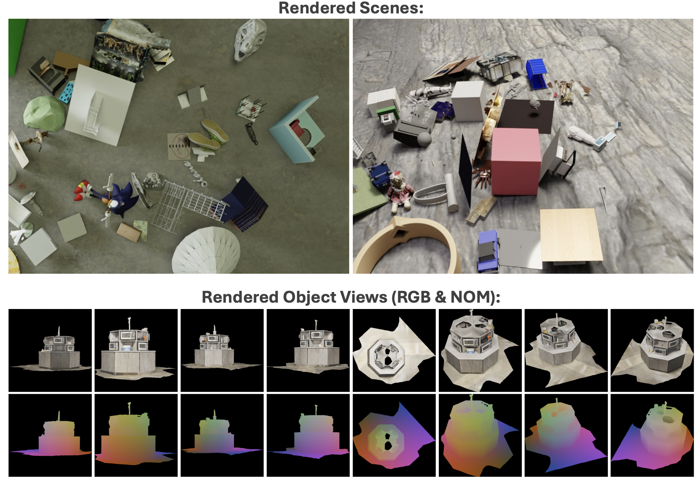

# BlenderProcObjaverse

This repository is a fork of the original [BlenderProc](https://github.com/DLR-RM/BlenderProc) and has been adapted to render a new synthetic dataset that includes Objaverse objects. The dataset is intended for training models in 6D Object Pose Estimation tasks. It supports rendering scenes with 40 objects and generating eight views per object.

This project is part of the Master's Thesis, "6D Object Pose Estimation Using Diffusion Models" by Simon Schläpfer at the Autonomous Systems Lab, ETH Zurich, in collaboration with Google Research, autumn 2024.



## Features

- Script to sample and download Objaverse objects.
- Script to render scenes with Objaverse objects. Object sampling is randomized, including variations in lighting, camera poses, background textures, and object materials.
- Script to render eight views per object (four side views, three top views, and one bottom view).

The launch scripts are optimized for parallel execution on CPU nodes (ETH Euler Cluster).

## Installation

```bash
git clone https://github.com/simonschlaepfer/BlenderProcObjaverse.git
cd BlenderProcObjaverse
pip install -e .
```

## Usage

### 1. Sample and download Objaverse objects

```bash
python main_objaverse_download.py
```

### 2. Render scenes with Objaverse objects

```bash
./launch_rendering_jobs.sh
```

You can adjust the number of rendering jobs by modifying the for-loop interval. Each submitted job creates 25 scenes, with each scene containing 25 camera poses and 40 objects. If you're generating many scenes, use the BOP toolkit to convert the data from scene-wise format to webdataset format.

### 3. Render object views

```bash
./launch_rendering_views_jobs.sh
```

Before running this, ensure that the NOM (Normal, Object, Material) maps are already rendered. The relevant script is available in the [NOM-Diffusion repository](https://github.com/Calimero/NOM-Diffusion).